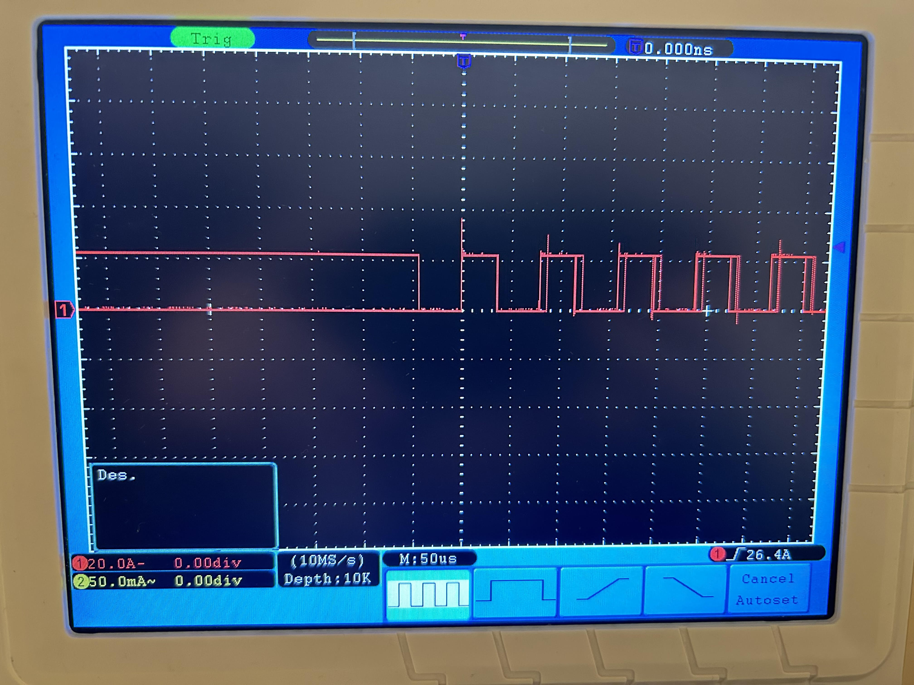

# PRACTICA 1 : BLINK
## TRABAJOS Y PERGUNTAS
1. Generar el programa  y subir el codigo  al github de cada uno.
2. Modificar el programa para que incluya el envio de datos (ON y OFF) al puerto serie.
    Añadir la inicialización del puerto serie y el envio cada vez que cambia el estado del led.
   - Iniciar pin de led como salida.
   - Iniciar el terminal serie.                      
   - Bucle infinito:  
       * Encender led  
       * Sacar por puerto serie mensaje *ON*          
       * Espera de 1000 milisegundos  
       * Apagar led  
       * Sacar por puesto serie mensaje *OFF*        
       * Espera de 1000 milisegundos
  
  **Codigo empleado:**
  ```c
  #include <Arduino.h>

#define LED_FLASH 23

void setup() 
{
  pinMode(LED_FLASH,OUTPUT);
  Serial.begin(115200);
  delay(500);
  Serial.println("HOLA MUNDO");
}

void loop() 
{
  Serial.println("ledhigh");
  digitalWrite(LED_FLASH,HIGH);
  delay(500);
  Serial.println("ledlow");
  digitalWrite(LED_FLASH,LOW);
  delay(500);
}
```

3. Modificar el programa para que actue directamente sobre los registros de los puertos de entrada y salida.

**...** 

4. Eliminar los delays. Modificar el pin de salida a uno cualquiera de los que estan disponibles y medir con el osciloscopio cual es la màxima frecuencia de apagado encendido que permite el microcontrolador. Medir la frecuencia en estos cuatro casos: 
   - Con el envio por el puerto série del mensaje y utilizando las funciones de Arduino
   - Con el envio por el puerto série y accediendo directamente a los registros
   - Sin el envio por el puerto série del mensaje y utilizando las funciones de Arduino
   - Sin el envio por el puerto série y accediendo directamente a los registros
5. Generar un informe fichero  informe.MD (markdown) donde se muestre el codigo, un diagrama de flujo y un diagrama de tiempos 
6. Responder a la siguiente pregunta: En el programa que se ha realizado ¿Cual es el tiempo libre que tiene el procesador?

<span style="color:white">
Gracias al osciloscopio podemos ver cuando la señal transmitida es inestable.

Sabiendo esto, podemos ir haciendo experimentos empíricos para determinar cual es la máxima frecuencia que permite el microcontrolador. Empezamos con 500 ms y bajamos hasta 1 ms con la función `delayMicroseconds()`. 





En este punto ya podemos apreciar que la señal que se nos muestra es inestable. Eso es debido a que el microcontrolador no "sabe" que instrucción tiene que ejecutar y empieza a perderse.</span>


