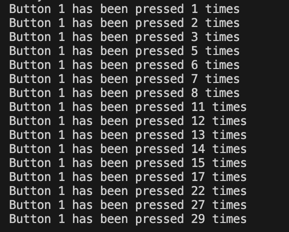
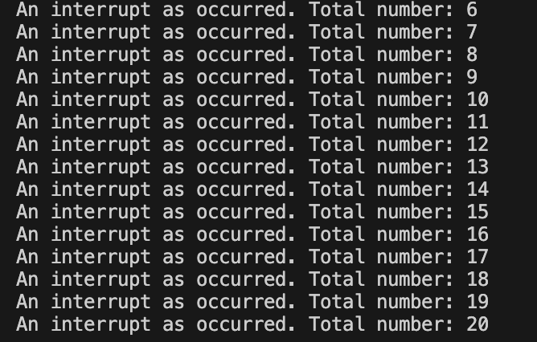

# PRÁCTICA 2 : INTERRUPCIONES 

## Práctica A interrupción por GPIO 

El montaje a realizar es el siguiente:


Ejemplo de código:


    struct Button {
      const uint8_t PIN;
      uint32_t numberKeyPresses;
      bool pressed;
    };

    Button button1 = {18, 0, false};

    void IRAM_ATTR isr() {
      button1.numberKeyPresses += 1;
      button1.pressed = true;
    }

    void setup() {
      Serial.begin(115200);
      pinMode(button1.PIN, INPUT_PULLUP);
      attachInterrupt(button1.PIN, isr, FALLING);
    }

    void loop() {
      if (button1.pressed) {
          Serial.printf("Button 1 has been pressed %u times\n", button1.numberKeyPresses);
          button1.pressed = false;
      }

      //Detach Interrupt after 1 Minute
      static uint32_t lastMillis = 0;
      if (millis() - lastMillis > 60000) {
        lastMillis = millis();
        detachInterrupt(button1.PIN);
         Serial.println("Interrupt Detached!");
      }
    }

### INFORME
  
Como vemos en el código proporcionado aquí arriba:
1. Se genera una tupla con tres miembros:
   - PIN: Representa el pin al que está conectado nuestro "botón".
   - numberKeyPresses: Será el contador de veces que se ha pulsado el "botón".
   - pressed: Un booleano que muestra si el botón está presionado o no.
2. Ahora inicializamos el botón al pin 18, ponemos el contador a 0 y el booleano en false.
3. Se define una función `isr()` (interrupt service routine) que incrementa el contador y establece "pressed" en true.
4. Se define la función `setup()` que inicia la comunicación serial a 115200 baudios, se configura el pin del botón y también se escribe la interrupción.
5. En la función `loop()` se abre un "if" que verifica si el botón está presionado. Si es el caso, imprime un mensaje con las veces que ha sido presionado.
6. En esta misma función, se implementa un temporizador que deshabilita la función de interrupción a los 60000 ms.

Aquí adjunto una foto del mensaje que muestra la terminal:



## Practica B Interrupción por timer 

El código de la práctica es el siguiente: 
```
volatile int interruptCounter;
int totalInterruptCounter;
 
hw_timer_t * timer = NULL;
portMUX_TYPE timerMux = portMUX_INITIALIZER_UNLOCKED;
 
void IRAM_ATTR onTimer() {
  portENTER_CRITICAL_ISR(&timerMux);
  interruptCounter++;
  portEXIT_CRITICAL_ISR(&timerMux);
 
}
 
void setup() {
 
  Serial.begin(115200);
 
  timer = timerBegin(0, 80, true);
  timerAttachInterrupt(timer, &onTimer, true);
  timerAlarmWrite(timer, 1000000, true);
  timerAlarmEnable(timer);
 
}
 
void loop() {
 
  if (interruptCounter > 0) {
 
    portENTER_CRITICAL(&timerMux);
    interruptCounter--;
    portEXIT_CRITICAL(&timerMux);
 
    totalInterruptCounter++;
 
    Serial.print("An interrupt as occurred. Total number: ");
    Serial.println(totalInterruptCounter);
 
  }
}
```

### INFORME

Este código utiliza un temporizador `hw_timer_t` para generar interrupciones periódicas.

Vamos a analizar el código parte por parte:
1. Se declaran dos variables:
    - volatile int interruptCounter
    - int totalInterruptCounter: Almacena el número total de interrupciones. 
2. Se declara un puntero en `hw_timer_t` y se inicializa con NULL. El objeto `portMUX_TYPE` se utiliza para manejar de forma segura las interrupciones.
3. Se genera una función `onTimer()` que suma en el contador interruptCounter.
4. En la función `setup()` 
     - Se inicia la comunicación série a 115200 baudios.
     - Se inicia el temporizador
     - Se llama a la rutina de interrupción `onTimer()`.
     - `timerAlarmWrite` se utiliza para establecer el valor de la alarma del temporizador. En resumen, esta linea de código configura el temporizador para generar una interrupción cada segundo (1000000 ms).
     - `timerAlarmEnable` se utiliza para habilitar la alarma del temporizador.
5. En la función `loop()` se verifica si hay interrupciones pendientes con interruptCounter > 0 y se imprime el número total de interrupciones.

Aquí adjunto una foto del mensaje que muestra la terminal:



El problema de este código es que cada segundo debe comprobar si ha ocurrido alguna interrupción, en cambio, con el código de la práctica A, la interrupción se produce solo cuando se ha pulsado el botón.
Por lo tanto, podemos decir que el código de la práctica A es mucho más eficiente, ya que la interrupción se produce solo en el caso de ser pulsado el botón y mientras no se pulse, el microprocesador puede ir ejecutando otros procedimientos.


*Nota: En el código main.cpp están escritos los dos códigos utilizados en estas dos prácticas. Uno está marcado como anotación y otro no. Para que funcione uno u otro desmarca el deseado.* 
