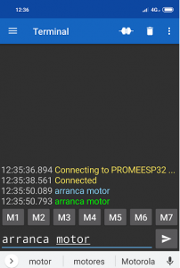

# PRÁCTICA 3: WIFI  y BLUETOOTH  
## Práctica B: Comunicación bluetooth con el móvil 
### INFORME

El código utilizado para esta práctica es el siguiente:

```c
#include <Arduino.h>
#include "BluetoothSerial.h"

/*#if !defined(CONFIG_BT_ENABLED) || !defined(CONFIG_BLUEDROID_ENABLED)
#error Bluetooth is not enabled! Please run `make menuconfig` to and enable it
#endif*/

BluetoothSerial SerialBT;
void setup() {
Serial.begin(115200);
SerialBT.begin("ESP32testjoan"); //Bluetooth device name
Serial.println("The device started, now you can pair it with bluetooth!");
}
void loop() {
if (Serial.available()) {
SerialBT.write(Serial.read());
}
if (SerialBT.available()) {
Serial.write(SerialBT.read());
}
delay(20);
}
```
Vamos a analizar este código punto por punto:
1. Primero de todo incluimos las bibliotecas necesarias:
    - Arduino.h
    - BluetoothSerial.h
2. Se crea un objeto de la clase BluetoothSerial llamado SerialBT.
3. En la función `setup()`:
    - Se inicia la comunicación serial a 115200 baudios.
    - Se inicializa la comunicación bluetooth, con el nombre "ESP32testjoan".
    - Se imprime un mensaje conforme el bluetooth del microprocesador está activado y se puede emparejar con otro dispositivo.
4. En la función `loop()`:
    - En el primer `if` se verifica si hay datos disponibles en el puerto serial USB. Si existen datos, se escriben en el puerto serial bluetooth.
    - En el otro `if` se verifica si hay datos disponibles en el puerto serial bluetooth. Si existen datos, se escriben en el puerto serial USB.
    - Se incluye un delay para evitar saturaciones del microprocesador.

Gracias a este código y la conexión bluetooth del microprocesador podemos hacer una conexión serial entre nuestro móvil y el ordenador. Esto nos permite enviar texto de un dispositivo a otro de manera casi instantánea a través de la tecnología bluetooth.



En esta imagen podemos ver como se vería la comunicación. En azul vemos el mensaje mandado por el microprocesador y en verde el menaje enviado por nuestro móvil.


