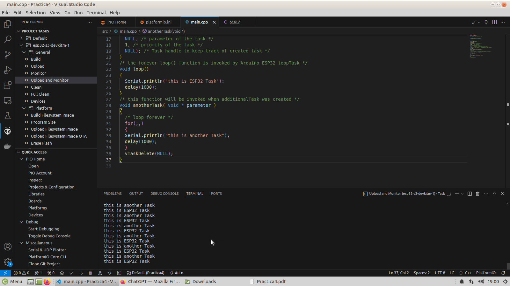

# PRACTICA 4 :  SISTEMAS OPERATIVOS EN TIEMPO REAL  

El objetivo de la practica es comprender el funcionamiento de un sistema operativo en tiempo Real.

Para lo cual realizaremos una practica  donde  generaremos varias tareas  y veremos como se ejecutan dividiendo el tiempo de uso de la cpu.


## Ejercicio Practico 1 


### 1. Descibir la salida por el puerto serie 

El codigo utilizado es el siguiente:

```c
#include <Arduino.h>
#include <FreeRTOS.h>

const int led1 = 2; // Pin of the LED

// Function prototype
void anotherTask(void * parameter);

void setup()
{
  Serial.begin(112500);
  /* we create a new task here */
  xTaskCreate(
  anotherTask, /* Task function. */
  "another Task", /* name of task. */
  10000, /* Stack size of task */
  NULL, /* parameter of the task */
  1, /* priority of the task */
  NULL); /* Task handle to keep track of created task */
}
/* the forever loop() function is invoked by Arduino ESP32 loopTask */
void loop()
{
  Serial.println("this is ESP32 Task");
  delay(1000);
}
/* this function will be invoked when additionalTask was created */
void anotherTask( void * parameter )
{
  /* loop forever */
  for(;;)
  {
  Serial.println("this is another Task");
  delay(1000);
  }
  vTaskDelete(NULL);
}
```
A la salida del puerto serie tenemos este mensaje:


Donde podemos ver que se están ejecutando dos tareas simultáneamente en los dos núcleos diferentes del microcontrolador.

### 2. Explicar el funcionamiento 

Este código es un ejemplo de cómo utilizar FreeRTOS. Este es un sistema operativo que permite la ejecución concurrente de múltiples tareas en los microcontroladores.
1. Para trabajar con este sistema debemos incluir la biblioteca `<FreeRTOS.h>`.
2. Se define una constante led1 que representa el pin al que está conectado el LED.
3. Después se declara una función llamada `anotherTask`, que será la tarea que se creará como una tarea separada en FreeRTOS.
   - Simplemente imprime un mensaje en serie cada segundo en un bucle infinito.
   - Al final de esta función se utiliza `vTaskDelete(NULL)` para eliminar la tarea, pero como el bucle es infinito, nunca se ejecutará este comando.
5. Función `setup()`:
   - Se inicia la comunicación serial y se crea una nueva tarea utilizando `xTaskCreate()` con los siguientes parámetros: `anotherTask` especifica la función que se ejecutará de simultáneamente. `"another Task"` es el nombre de la tarea. `10000` es el tamaño del stack asignado a la tarea en bytes. `1` es la prioridad de la tarea (0 prioridad más baja y 1 prioridad más alta).
6. Función `loop()`:
   - Esta función imprime un mensaje cada segundo. 


