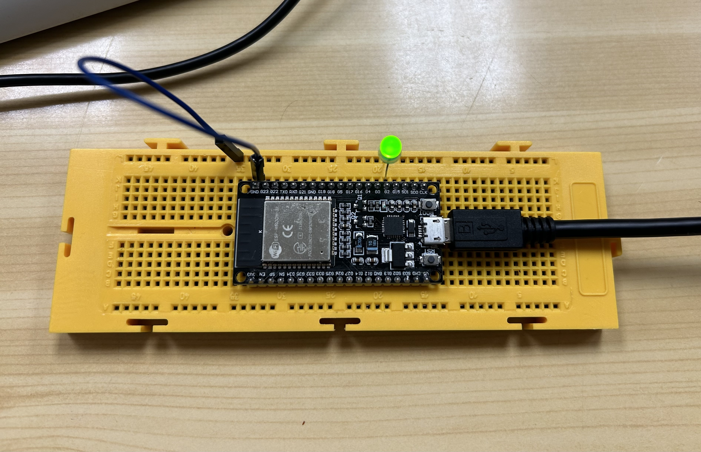

# PRACTICA 4 :  SISTEMAS OPERATIVOS EN TIEMPO REAL  

El objetivo de la practica es comprender el funcionamiento de un sistema operativo en tiempo 
Real .

Para lo cual realizaremos una practica  donde  generaremos varias tareas  y veremos como 
se ejecutan dividiendo el tiempo de uso de la cpu.


## Ejercicio Practico 2

A realizar  como ejercicio  en casa 

### 1. Realizar un programa que utilice dos tareas  una enciende un led y otra  lo apaga. Dichas tareas deben estar sincronizadas

El código utilizado es el siguiente:

```c
#include <Arduino.h>
#include <FreeRTOS.h>

const int led1 = 2; // Pin of the LED

// Function prototype
void toggleLED(void * parameter);

void setup()
{
  Serial.begin(115200); // Cambiado a una velocidad de transmisión más común
  pinMode(led1, OUTPUT); // Configura el pin del LED como salida
  
  // Creamos la tarea para controlar el LED
  xTaskCreate(
    toggleLED,          // Función de la tarea
    "Toggle LED",       // Nombre de la tarea
    10000,              // Tamaño de la pila de la tarea
    NULL,               // Parámetro de la tarea
    1,                  // Prioridad de la tarea
    NULL                // Manejador de la tarea (no utilizado)
  );
}

void loop()
{
  // No necesitamos un bucle loop() ya que vamos a usar FreeRTOS para manejar las tareas.
}

// Esta función se invoca cuando se crea la tarea toggleLED
void toggleLED(void * parameter)
{
  for (;;) // Bucle infinito
  {
    digitalWrite(led1, HIGH);   // Enciende el LED
    vTaskDelay(1000 / portTICK_PERIOD_MS); // Espera 1 segundo
    digitalWrite(led1, LOW);    // Apaga el LED
    vTaskDelay(1000 / portTICK_PERIOD_MS); // Espera 1 segundo
  }
}
```
1. Se declara un prototipo de función llamado `toggleLED`, que será la tarea encargada de controlar el LED.
2. Función `setup()`:
   - Se inicia la comunicación serial.
   - Se configuta el pin LED como salida.
   - Se crea la tarea `toggleLED` utilizando `xTaskCreate()`.
3. Función `toggleLED()`:
   - Es una tarea que se ejecuta con un bucle infinito for. En este caso para alternar el estado del LED entre encendido y apagado, con delays de 1 segundo entre cada cambio.

El conexionado se vería así:



