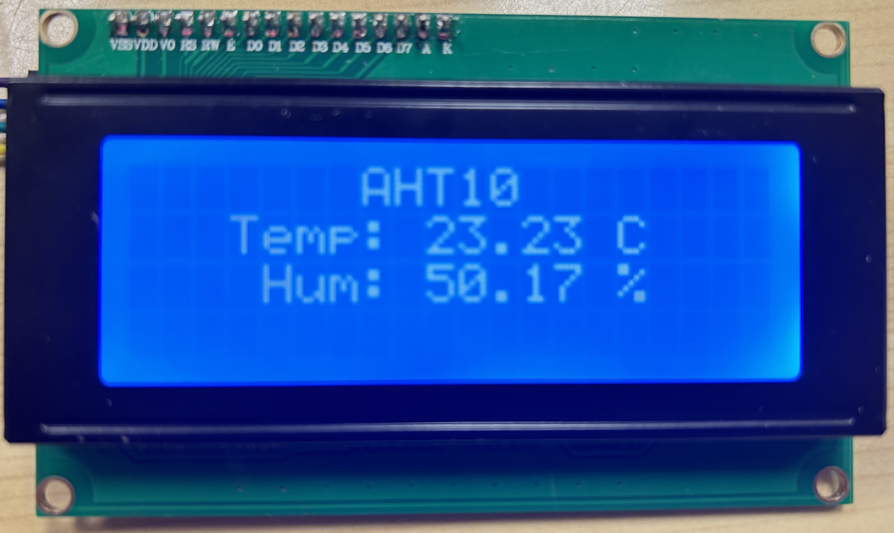
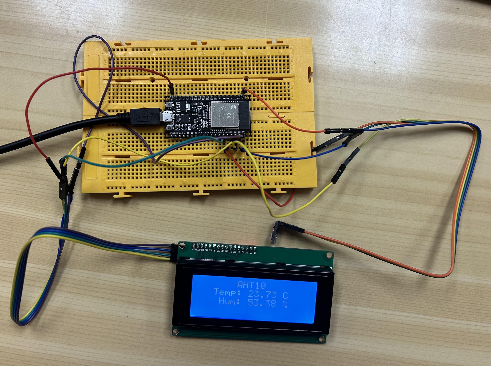

# PRACTICA 5 :  Buses de comunicación I (introducción y I2c)  

El objetivo de la practica es comprender el funcionamiento de los buses
  sistemas de comunicación entre periféricos;  estos elementos pueden 
  ser internos o externos  al procesador.

Esta es la primera practica de  4 donde se verán los buses i2c, spi,
 i2s , usart.

Para lo cual realizaremos una practica en cada caso donde controlaremos 
 un periférico de ejemplo


## Ejercicio Practico 2

A realizar  como ejercicio  en casa 

1. Realizar un programa que utilice un dispositivo i2c como por ejemplo alguno de los  siguientes  

-----------------------------------------------------------------------

**Display oled** **I2C SSD1306 OLED**  ( display de leds organicos )  
referencia https://programarfacil.com/blog/arduino-blog/ssd1306-pantalla-oled-con-arduino/


o este otro formato


El programa utilizado es el siguiente:
```c 
#include <Arduino.h>
//YWROBOT
//Compatible with the Arduino IDE 1.0
//Library version:1.1
#include <LiquidCrystal_I2C.h>
#include <SPI.h>
#include <Wire.h>
#include <Adafruit_GFX.h>
#include <Adafruit_SH110X.h>
#include <Adafruit_AHTX0.h>
#include <Fonts/FreeSans9pt7b.h>


LiquidCrystal_I2C lcd =  LiquidCrystal_I2C(0x3F,20,4);
Adafruit_AHTX0 aht;

void setup() {
  Serial.begin(115200);
  //while (!Serial);
    
    lcd.init();                      // initialize the lcd 
  // Print a message to the LCD.
  lcd.backlight();
  lcd.print("                                                                                                                    ");
  Serial.println("Display humedad y temp.");
  if (aht.begin()) {
    Serial.println("Found AHT20");
  } else {
    Serial.println("Didn't find AHT20");
  }  


}

void loop() {
  //display.clearDisplay();
  sensors_event_t humidity, temp;
  
  aht.getEvent(&humidity, &temp);// populate temp and humidity objects with fresh data

  lcd.setCursor(7,0);
  lcd.print("AHT10");
  lcd.setCursor(3,1);
  lcd.print("Temp: "); 
  lcd.print(String(temp.temperature)); 
  lcd.print(" C");
  lcd.setCursor(4,2);
  lcd.print("Hum: "); 
  lcd.print(String(humidity.relative_humidity)); 
  lcd.print(" %");
  Serial.print("Temperature: ");Serial.print(temp.temperature);Serial.println(" degrees C");
  Serial.print("Pressure: ");Serial.print(humidity.relative_humidity);Serial.println(" RH %");
  
  delay(1000);
}
```

Se ha utilizado la libreria LiquidCrystal para hacer la conexión con la pantalla LCD y con el módulo AHT10.

El resultado de escribir este código y montar el hardware corectamente es el siguiente:



### Funcionamiento del código
Este código es un programa que utiliza varios módulos y biblotecas para mostrar la temperatura y humedad en una pantalla LCD I2C. 
1. Librerias:
   - `<Arduino.h>`: Librería principal de Arduino.
   - `<LiquidCrystal_I2C.h>`: Librería para controlar la pantalla LCD mediante protocolo I2C.
   - `Adafruit_AHTX0.h>`: Librería para el sensor AHT10 (sensor de temperatura).
   - `Wire.h`: Librería para controlar la comunicación I2C.
2. Inicailización
   - `LiquidCrystal_I2C lcd = LiquidCrystal_I2C(0x3F, 20, 4);`: Inicializa un objeto lcd para controlar la pantalla, con parámetros de dirección (0x3F) y dimesniones.
   - `Adafruit_AHTX0 aht;`: Inicializa un objeto aht para comunicarse con el sensor de temperatura.
3. Función `setup()`:
   - Se inicializa la comunicación en serie a 115200 baudios.
   - `lcd.init()`: Inicializa la pantalla LCD.
   - `lcd.backlight()`: Inicializa la luz de fondo de la pantalla.
   - Hace un print para limpiar la pantalla.
   - Verfica si el sensor esta disponible e imprime un mensaje en pantalla dependiendo de la respuesta.
4. Funcón `loop()`:
   - `aht.getEvent(&humidity, &temp);`: Obtiene los valores de humedad y temperatura del sensor.
   - Se escriben estos valores en posiciones especificas de la pantalla con la función `setCursor()`.
   - Espera 1 segundo antes de repetir el proceso y volver a obtener nuevos valores.